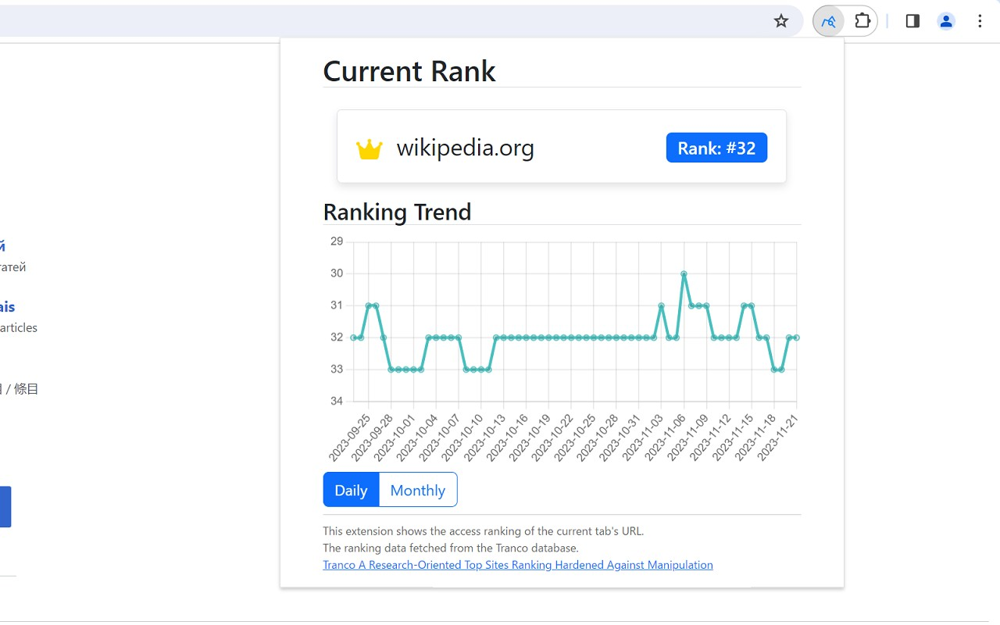

# top-sites-ranking-extension



## Overview

This repository is source codes of Chrome extension "Web Site Access Ranking Checker". This is a Chrome extension that displays the access ranking of the currently visited website. It provides an easy way to view both the real-time and historical popularity rankings of websites, leveraging data from the Tranco List.

## Features

- Real-time access ranking of the current website.
- Historical ranking trends displayed in daily and monthly graphs.
- Data sourced from the [Tranco List](https://tranco-list.eu/).

## How to build and submit extension

- `npm install`
- `npm run build`
- (for firefox) Add the following to the beginning of `dist/manifest.json`:

```
"browser_specific_settings": {
    "gecko": {
      "id": "shigaichi@github.com"
    }
  },
}
```

- Zip all files in the `dist` folder and submit it.
